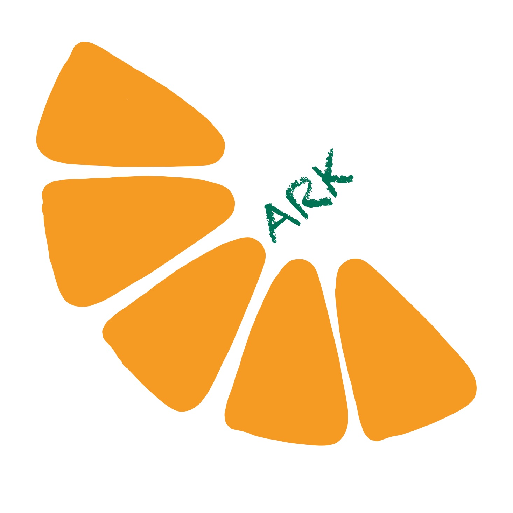

# ARK Banking System
[]

Check it out!: https://ark-banking.onrender.com/

## Demo Video

## Overview and Features

The Ark Banking system is an intuitive that was built using 

 - **Backend**: Python 3.13, Flask 3.0.0
 - **Frontend**: HTML5, CSS3, Javascript
 - **Deployment**: Render (with gunicorn)
 - **Data Storage**: Text-based file system
 - **Session Management**: Flask sessions with secure cookies

### Account Management
- **User Registration** - Create accounts with secure password requirements
- **User Authentication** - Secure login/logout functionality
- **Multiple Account Types** - Support for checking, savings, or both account types
- **Account Dashboard** - Clean overview of all accounts and balances

### Banking Operations
- **Deposits** - Add funds to checking or savings accounts
- **Withdrawals** - Remove funds from checking or savings accounts
- **Transfers** - Move money between checking and savings accounts instantly
- **Transaction History** - Complete record of all banking activities

### Security Features
- **Password Validation** - Requires uppercase, numbers, and special characters
- **Session Management** - Secure 30 minute session timeout
- **Form Validation** - Client side and server side validation

### User Interface
- **Modern Design** - Clean orange themed interface
- **Responsive Layout** - Works seamlessly on desktop and mobile devices
- **Visual Feedback** - Success/error messages for all operations
- **Intuitive Navigation** - Easy to use interface with clear action buttons

## Data Persitence

So when building this application, I built it with a file data system. All this means is that all of my data is stored within a txt file and is read and written from there. I used this method in stead of a traditional SQL database because I first started this project when I was learning to code and I found that connecting data through multiple different files was good practice to hone my system design skills. I used the website **Render** to deploy my site, and for the most part, it does a good job and presents a fully functional site. The way render works is by cloning my github repository and storing new data in Render's free tier ephemeral storage. So unfortunately, all of the data files reset when the application restarts, which happens approximately 30 minutes after idling. However there are two ways to get arounds this. The first way is the easy way out, which is simply paying Render to run 24/7 for approximately $1 per GB of stoarge per month. This ensures all data is stored so new users can log into their accounts whenever they want. The other way is free, but a little more complicated. I would just turn github into a make-shift data base. 

## How the make shift data base would work: 

## For the Future

I would like to work a little bit more on this in the future so here are a couple of things that I am planning on doing. I would like to create a version two of this that uses PostgreSQL so it is easier to manage data. I would like to include an email verification for safety of ARK customers. 2 factor authentication for all users would be nice to have. And another thing that I would like to create in the future is PDF creation for individual's transaction reports.
